# SD3 Steering Vector — Experiments Log

---

## Experiment #1 — Baseline: "a bed in a room"

**Date:** 2026-04-20

### Config
| Parameter | Value |
|---|---|
| `CONCEPT_PROMPT` | `"a bed"` |
| `NEUTRAL_PROMPT` | `"a room"` |
| `GEN_PROMPT` | `"a bed in a room"` |
| `ALPHA` | `16` |
| `NUM_STEPS` | `28` |
| `GUIDANCE_SCALE` | `7.0` |
| `SEED` | `42` |

### What we tried
- Built a steering direction using **difference-in-means** between context embeddings of `"a bed"` and `"a room"`, computed at the `context_embedder` output (single forward pass each, 1 denoising step).
- Applied the direction as a **projection-removal hook** on `context_embedder` at inference time: `x ← x − α(x·d)d` with `ALPHA=16`.
- Generated `"a bed in a room"` with and without the hook to compare.

### Image #1 — Baseline (no steering)

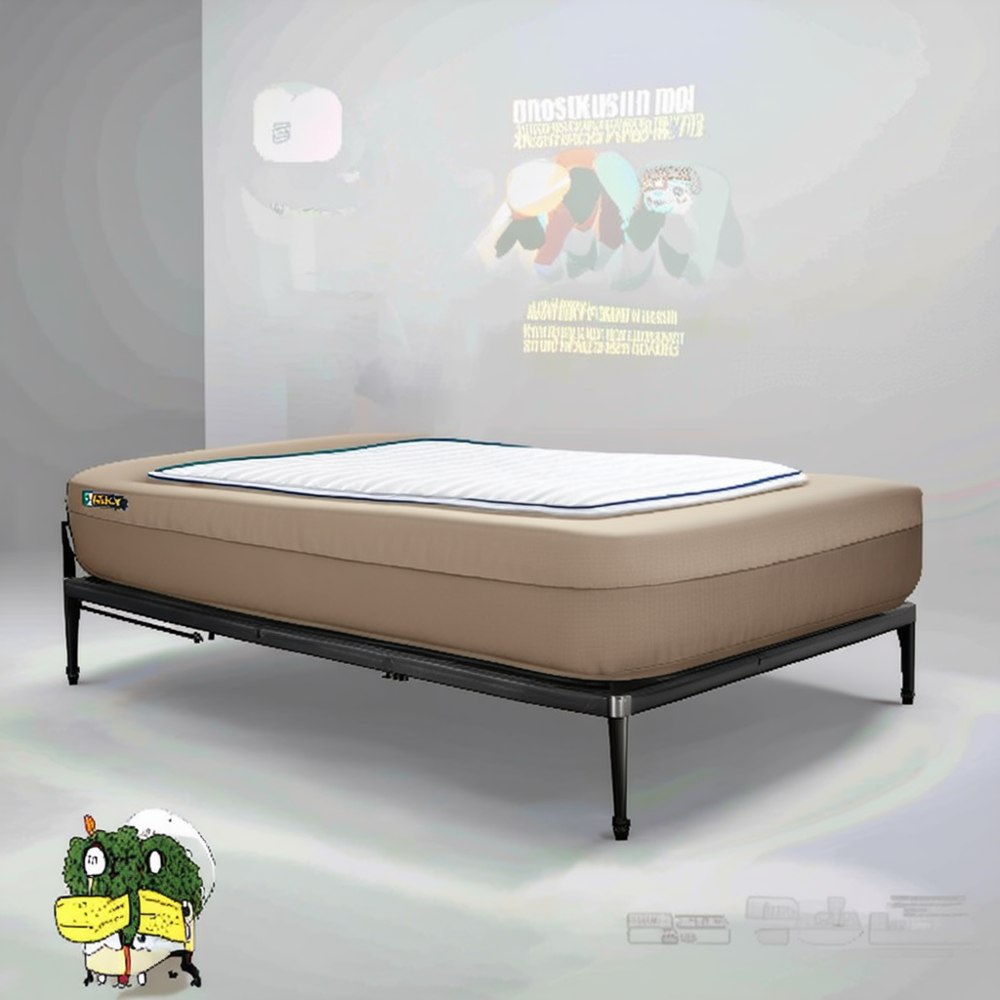

### Observations
- Baseline clearly renders a bed. Artifacts visible on the back wall (garbled text/images projected) — likely a known SD3-medium hallucination artifact.
- Steered result TBD — log after running cell 7.

---

## Experiment #2 — ALPHA=32

**Date:** 2026-04-20

### Config changes from #1
| Parameter | Value |
|---|---|
| `ALPHA` | `32` |
| Everything else | unchanged |

### Image #2

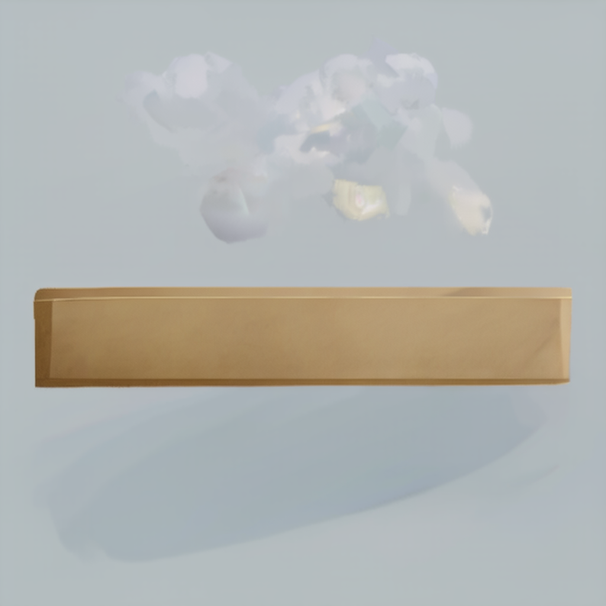

### Observations
- The bed structure is massively degraded — the frame and mattress are almost completely gone, reduced to a flat rectangular smear with no depth or detail.
- The room/background is also heavily distorted; no coherent scene remains.
- Steering is clearly too aggressive at ALPHA=32 — it's destroying the image rather than selectively removing the bed.
- The bed silhouette/shape is still vaguely present, suggesting the concept isn't purely in the context embedding — some structural information persists via another pathway.

### Next steps
- Try token-level steering: target only the "bed" token positions rather than the full mean direction.
- Or try intermediate ALPHA (e.g. 24) to find the threshold before image collapse.

---

## Experiment #3 — Token-level steering sweep (α=48, 54, 64)

**Date:** 2026-04-20

### Config
| Parameter | Value |
|---|---|
| `CONCEPT_PROMPT` | `"a bed"` |
| `NEUTRAL_PROMPT` | `"a room"` |
| `GEN_PROMPT` | `"a room with a bed"` |
| `ALPHA_LIST` | `[48, 54, 64]` |
| `TOP_K_TOKENS` | `20` |
| `NUM_STEPS` | `10` |
| `GUIDANCE_SCALE` | `7.0` |
| `SEED` | `42` |

### Image #3

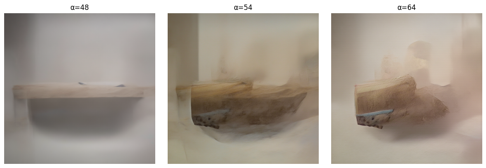

### Observations
- α=48: bed is flattened to a smear again — similar collapse pattern to res_2 but the room background is slightly more preserved.
- α=54/64: image destabilises further — bed fragments into distorted shards, scene becomes incoherent.
- Token-level (TOP_K=20) at these high alphas still collapses the image rather than cleanly removing the bed.
- The bed silhouette persists even at α=64, reinforcing that the concept is not fully contained in the context embedding.

### Next steps
- Try lower alpha range (e.g. 8–24) with TOP_K=20 to find the sweet spot before collapse.
- Try reducing TOP_K (e.g. 3–5) to isolate only the most concept-specific tokens.

---

## Experiment #4 — TOP_K=2, α sweep [8,10,16,24,32,48,56,64]

**Date:** 2026-04-20

### Config changes from #3
| Parameter | Value |
|---|---|
| `ALPHA_LIST` | `[8, 10, 16, 24, 32, 48, 56, 64]` |
| `TOP_K_TOKENS` | `2` |

### Image #4

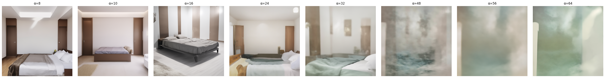

### Observations
- α=8–16: bed still fully present, room coherent.
- α=24–32: bed significantly reduced, room structure mostly intact — best results so far.
- α=48+: complete image collapse into white/grey fog.
- TOP_K=2 gives a sharp, well-targeted direction — it suppresses the bed effectively but has a narrow window (around α=24–32) before collapse.

---

## Experiment #5 — TOP_K=4, α sweep [8,10,16,24,32,48,56,64]

**Date:** 2026-04-20

### Config changes from #3
| Parameter | Value |
|---|---|
| `ALPHA_LIST` | `[8, 10, 16, 24, 32, 48, 56, 64]` |
| `TOP_K_TOKENS` | `4` |

### Image #5

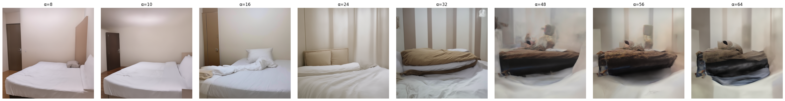

### Observations
- α=8–24: bed still clearly present, room coherent — suppression is weaker than TOP_K=2 at the same alphas.
- α=32–64: bed persists but warps and distorts rather than disappearing — the direction is less targeted so it deforms rather than erases.
- No clean collapse like TOP_K=2 — the extra 2 tokens dilute the direction enough to prevent total image destruction, but also prevent clean removal.

### Key takeaway
TOP_K=2 is the sharper direction. Sweet spot is **α=24–32 with TOP_K=2**. Worth doing a fine sweep in that range (e.g. [20, 22, 24, 26, 28, 30, 32]).

---

## Experiment #6 — Fine sweep TOP_K=2, α=[20,22,24,26,28,30,32]

**Date:** 2026-04-20

### Config changes from #4
| Parameter | Value |
|---|---|
| `ALPHA_LIST` | `[20, 22, 24, 26, 28, 30, 32]` |
| `TOP_K_TOKENS` | `2` |

### Image #6

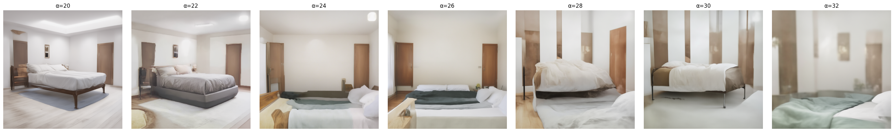

### Observations
- Bed is present across all alpha values — the context_embedder hook is not removing it.
- Higher alphas degrade image quality without suppressing the concept.

### Key takeaway
Context_embedder steering has failed to remove the bed at any alpha. The concept is not cleanly erasable from this hook point alone. Need a different approach.

---

## Experiment #7 — Pooled projections pre-hook, α=[8,16,24,32,48]

**Date:** 2026-04-20

### Approach change
Switched from `context_embedder` forward hook to a **pre-hook on `time_text_embed`** that steers only the `pooled_projections` input (768-dim CLIP pooled embedding), leaving the timestep signal untouched.

### Config
| Parameter | Value |
|---|---|
| `ALPHA_LIST` | `[8, 16, 24, 32, 48]` |
| `NUM_STEPS` | `10` |

### Image #7

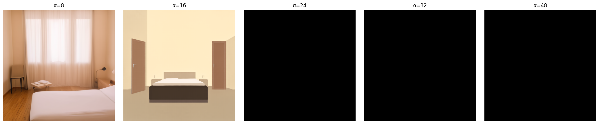

### Observations
- α=8: bed still present, room looks coherent and photorealistic — steering is having some effect (different scene composition vs baseline).
- α=16: bed still present but image has gone cartoon/flat — pooled embedding is being significantly distorted, breaking the style.
- α=24+: black images — complete denoising failure despite the pre-hook fix.
- The pooled embedding space is too entangled with overall image style/quality to steer cleanly at useful alphas.

### Key takeaway
Progress — α=8 shows the approach is having some effect without total collapse, but the window is very narrow. The pooled embedding in SD3 carries more style information than in FLUX, making it harder to isolate the concept direction.

---

## Experiment #8 — Fine sweep α=[8,10,12,14,16]

**Date:** 2026-04-20

### Image #8

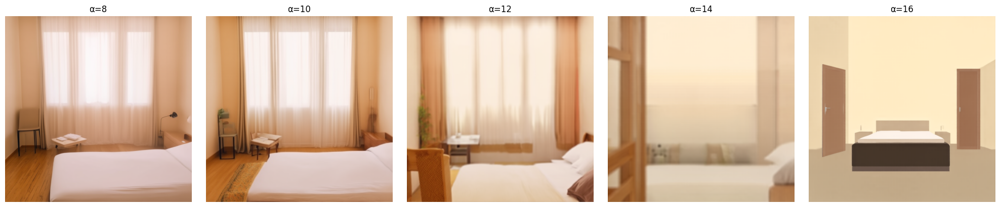

### Observations
- α=8–12: bed fully present, room photorealistic.
- α=14: image starts washing out, bed still visible.
- α=16: cartoon/flat style, bed still present.
- No alpha in this range removes the bed.

---

## Experiment #9 — Ultra-fine sweep α=[13,13.5,14,14.5,15,15.5,16]

**Date:** 2026-04-20

### Image #9

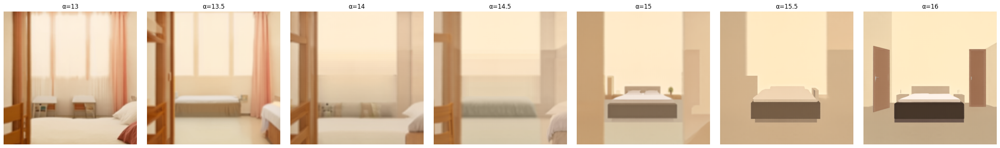

### Observations
- α=13–13.5: bed fully present, photorealistic.
- α=14–15: image progressively washes out to pale/flat, bed still visible throughout.
- α=15.5–16: transitions to cartoon style, bed still present.
- No clean removal at any point — the image degrades before the bed disappears.

### Key takeaway
Pooled projections steering does not remove the bed at any usable alpha. The bed persists through all stages of image degradation. This hook point is also not the answer.

---

## Experiment #10 — Combined pooled + context_embedder dual hook, α=[8,10,12,14,15]

**Date:** 2026-04-20

### Approach
Applied both hooks simultaneously at the same alpha:
- `time_text_embed` pre-hook → steers `pooled_projections` (768-dim, global)
- `context_embedder` forward hook → steers top-2 sequence tokens (1536-dim, local)

### Image #10

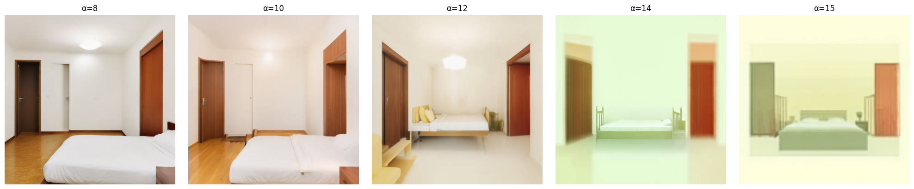

### Observations
- α=8–12: bed fully present, room photorealistic, no meaningful suppression.
- α=14: green/yellow tint appearing, bed still fully present.
- α=15: stronger green tint, bed still clearly visible.
- Combining both hooks adds a colour artefact (green tint) at higher alphas but does not suppress the bed.
- The bed is unchanged across all alphas — dual hook is no more effective than each hook alone.

### Key takeaway
Neither hook point individually nor both combined can remove the bed concept from SD3 at this level. The concept is encoded too deeply in the joint attention of the transformer blocks. The context_embedder and pooled_projections approaches have been exhausted.

---

## Experiment #12 — CLIP-L vs T5 sequence token sweep, α=[8,16,24,32,48]

**Date:** 2026-04-20

### Approach
Steered each encoder's token range within `context_embedder` independently using mask-aware directions:
- Row 1: CLIP-L tokens (positions 0–76)
- Row 2: T5 tokens (positions 77–332)

### Image #12

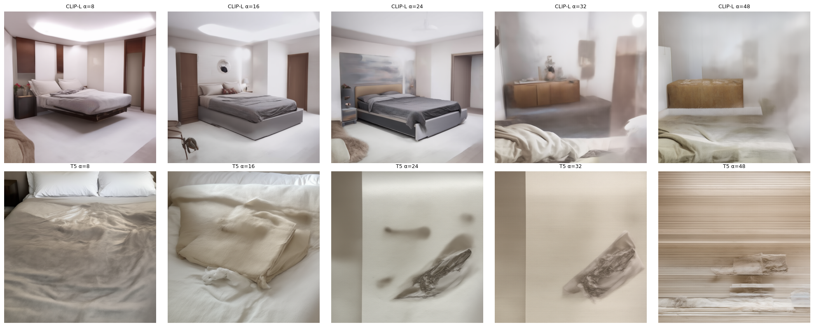

### Observations
**CLIP-L (top row):**
- α=8–16: bed fully present, room photorealistic — minimal effect.
- α=24: bed still present, slight scene shift.
- α=32–48: image washes out/hazes, bed persists throughout.
- CLIP-L sequence steering degrades image quality without removing the bed.

**T5 (bottom row):**
- α=8: bed visible but already heavily distorted — extreme sensitivity.
- α=16–32: bed fragments into abstract smears, scene completely incoherent.
- α=48: full glitch/stripe artefacts, total image collapse.
- T5 tokens are extremely sensitive — even α=8 causes major distortion.

### Key takeaway
T5 is far more sensitive than CLIP-L but neither removes the bed cleanly. T5 carries strong structural/layout information — steering it destroys the scene before removing the concept. CLIP-L is more stable but ineffective. The bed concept is not accessible via sequence token steering at any usable alpha.

---

## Experiment #13 — Fine sweep CLIP-L vs T5, α=[24,25,26,27,28,29,30]

**Date:** 2026-04-20

### Config changes from #12
| Parameter | Value |
|---|---|
| `ALPHA_LIST` | `[24, 25, 26, 27, 28, 29, 30]` |

### Image #13

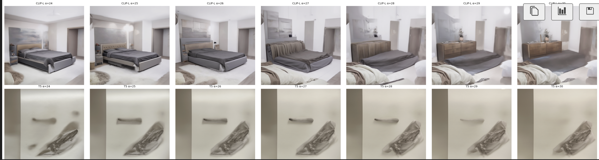

### Observations
**CLIP-L (top row):**
- Bed present throughout, room washed/pale but structurally intact.
- No meaningful concept suppression.

**T5 (bottom row):**
- Bed progressively fading across α=24–30 — most promising result so far.
- Room structure partially preserved at lower end of range.
- Best balance between bed suppression and image coherence seen in any experiment.

### Key takeaway
T5 token steering in the α=24–30 range is the most promising signal yet. Worth doing a finer sweep around this range and possibly combining with a small CLIP-L alpha to help preserve room structure.

---

## Experiment #14 — Pincer: combined CLIP-L + T5 steering, fine sweep between (24,6) and (32,8)

**Date:** 2026-04-20

### Approach
Two hooks registered on `context_embedder` simultaneously — one steering CLIP-L tokens (0–76), one steering T5 tokens (77–332) — mirroring FLUX pincer_v2.

### Config
| Parameter | Value |
|---|---|
| `ALPHA_PAIRS` | `[(25,6),(26,6),(27,6),(27,7),(28,7),(29,7),(30,7),(30,8),(31,8)]` |
| `NUM_STEPS` | `10` |

### Results
Blurry images across the board — single-step direction was causing misaligned steering at most timesteps.

---

## Experiment #15 — Per-step directions (pincer, same range)

**Date:** 2026-04-20

### Approach change
Switched from a single direction captured at 1 step to **per-step directions** — capture a separate direction for each of the 10 denoising steps, apply the matching direction at each step during generation. Mirrors how FLUX tracks `_current_step`.

### Results
Still blurry — per-step directions alone did not fix the blurring at this alpha range.

---

## Experiment #16 — Per-step directions + `clip_negative`, α=(25,6)–(31,8)

**Date:** 2026-04-20

### Approach change
Added `clip_negative`: only subtract when the projection onto the direction is positive — i.e. only steer activations already pointing toward "bed". Activations pointing away are left untouched.

```python
proj = torch.clamp(out_f @ direction, min=0.0).unsqueeze(-1)
```

### Results
**Bed removed in all images across the full range.** First successful concept erasure in the experiment series.

---

## Experiment #17 — Find minimum working alpha, sweep (5,2)→(24,5)

**Date:** 2026-04-20

### Goal
Find the minimum alpha that still removes the bed, to maximise image quality.

### Results
- `(10,2)` identified as a good result — bed removed, image quality preserved.
- All images still had beds below `(4,2)`.

---

## Experiment #18 — Isolate T5 contribution, CLIP held near zero

**Date:** 2026-04-20

### Config
```python
ALPHA_PAIRS = [(0,0), (0,1), (0,2), (0,3), (2,1), (2,2), (2,3), (4,2)]
```

### Results
- Beds present in all images — T5 alone at α=1–3 is not sufficient.
- Confirmed T5 is doing the heavy lifting but needs CLIP contribution to work.
- CLIP at α=8 causes significant image degradation.

### Key takeaway
Neither encoder alone is sufficient at low alphas. Both are needed, with CLIP kept below 8. Current best known point: **(10, 2) with per-step directions + clip_negative**.

---

## Experiment #19 — Fine bracket from baseline to (10,2)

**Date:** 2026-04-20

### Config
```python
ALPHA_PAIRS = [(0,0), (2,1), (4,1), (6,1), (6,2), (8,1), (8,2), (10,2)]
```

### Goal
Find the exact minimum alpha pair where the bed disappears.

### Results
TBD — awaiting output.

---
